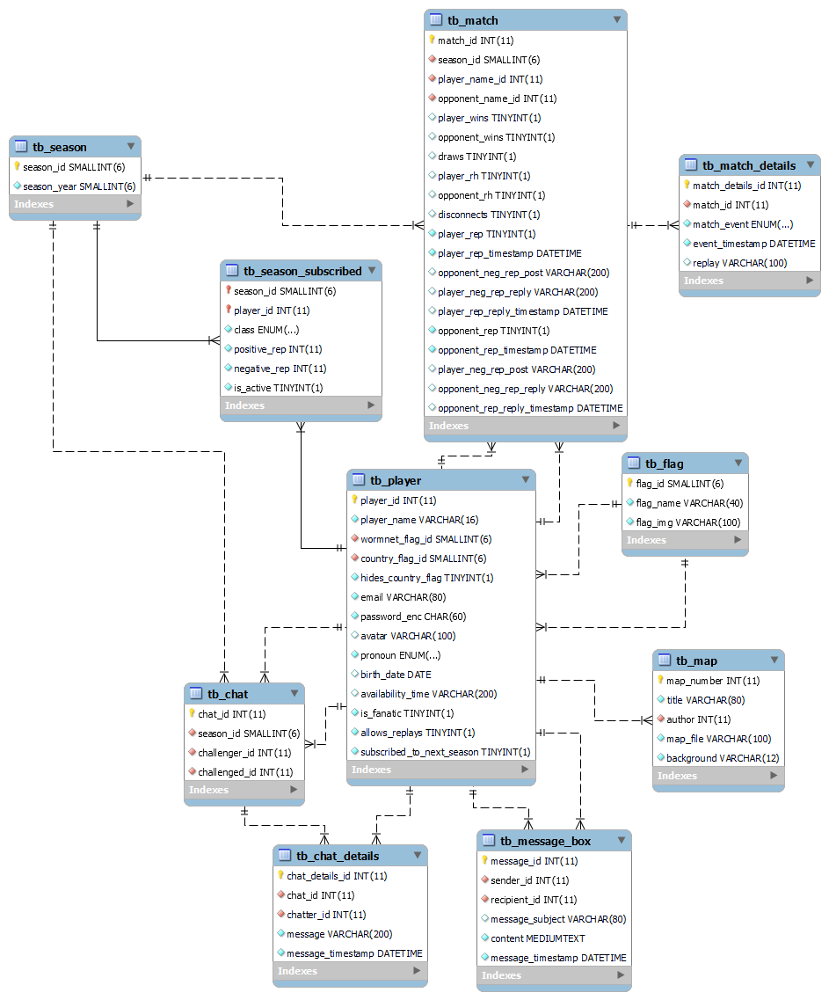

# Mole Community Database

> Status: Archived

## Purpose

This is the database structure for a future community website project.

## Display

The image below shows how the database is structured, using MySQL model:

|  |
| ------------------------------------------------------------------ |

## Development

The database structure and model were created in MySQL Workbench.

## Data

The database dump and the MySQL model files are available in the repo.

## Experience

Considering the database structure is relatively big, I was able to put to practice a lot of my MySQL knowledge, using commands not just for creating it, but also for adding random data and doing queries in order to make sure it is working as it should.

## Technologies
* MySQL